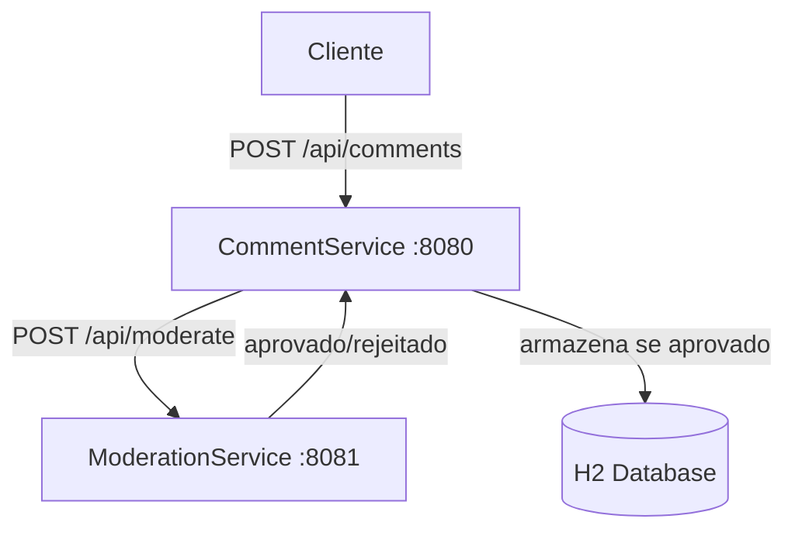

# AlgaComments Microservices

Um sistema distribuído de moderação de comentários construído com Spring Boot, que valida e armazena apenas comentários aprovados através de comunicação síncrona entre microsserviços.

[](https://openjdk.java.net/projects/jdk/21/)
[](https://spring.io/projects/spring-boot)

## 🏗️ Arquitetura do Sistema



### Microsserviços

| Serviço | Porta | Responsabilidade |
|---------|-------|------------------|
| **CommentService** | 8080 | Gerencia CRUD de comentários e integração com moderação |
| **ModerationService** | 8081 | Valida comentários contra lista de palavras proibidas |

**Comunicação**: HTTP/REST síncrona usando Spring RestClient

## ✨ Funcionalidades

- 🛡️ **Moderação**: Filtragem de conteúdo baseada em palavras-chave
- 💾 **Armazenamento**: Persiste apenas comentários aprovados
- 🔍 **Consulta**: Busca por ID e listagem paginada
- ⚡ **Comunicação Resiliente**: Timeout configurado e tratamento de erros

## 🛠️ Stack Tecnológica

- **Java 21** - Linguagem de programação
- **Spring Boot 3.x** - Framework principal
- **Spring RestClient** - Comunicação HTTP entre serviços
- **H2 Database** - Banco de dados em memória
- **Gradle** - Gerenciador de dependências

## 🚀 Início Rápido

### Pré-requisitos

- ☕ JDK 21+
- 🐘 Gradle 7.x+
- 🔧 Git

### Instalação e Execução

1. **Clone o repositório com submódulos**
   ```bash
   git clone --recurse-submodules git@github.com:apelisser/algacomments.git
   ```
   ```basht
   cd algacomments/microsservices
   ```

2. **Inicie o ModerationService**
   ```bash
   cd moderation-service
   ./gradlew bootRun
   ```
   > 🌐 Serviço disponível em: http://localhost:8081

3. **Inicie o CommentService** (novo terminal)
   ```bash
   cd comment-service
   ./gradlew bootRun
   ```
   > 🌐 Serviço disponível em: http://localhost:8080

### Verificação Rápida

#### Teste de criação de comentário
```bash

curl -X POST http://localhost:8080/api/comments \
  -H "Content-Type: application/json" \
  -d '{"text": "Ótimo conteúdo!", "author": "João"}'
```

#### Listar comentários
```bash
curl http://localhost:8080/api/comments
```

## 📖 Documentação da API

### 💬 CommentService (porta 8080)

#### Criar Comentário
```http
POST /api/comments
Content-Type: application/json

{
  "text": "Texto do comentário",
  "author": "Nome do autor"
}
```

**Respostas:**
- `201 Created` - Comentário aprovado e criado
- `422 Unprocessable Entity` - Comentário rejeitado pela moderação
- `502 Bad Gateway` - Erro de comunicação com o serviço de moderação
- `504 Gateway Timeout` - Timeout na moderação (>5s)

#### Buscar Comentário
```http
GET /api/comments/{id}
```

**Respostas:**
- `200 OK` - Comentário encontrado
- `404 Not Found` - Comentário não existe

#### Listar Comentários
```http
GET /api/comments?page=0&size=20
```

### 🛡️ ModerationService (porta 8081)

#### Moderar Comentário
```http
POST /api/moderate
Content-Type: application/json

{
  "text": "Texto para moderação",
  "commentId": "uuid-do-comentario"
}
```

**Resposta:**
```json
{
  "approved": true,
  "reason": "Comentário aprovado: nenhuma palavra proibida encontrada"
}
```

## ⚙️ Configurações e Regras

### Validações
- **IDs**: Devem ser UUIDs válidos
- **Timeout**: 5 segundos para comunicação entre serviços
- **Palavras Proibidas**: `["ódio", "xingamento"]` (configurável)

### Tratamento de Erros

| Cenário | Código HTTP | Descrição |
|---------|-------------|-----------|
| Comentário rejeitado | `422` | Contém palavras proibidas |
| Timeout de moderação | `504` | Serviço de moderação não responde |
| Erro de integração | `502` | Falha na comunicação entre serviços |
| Comentário não encontrado | `404` | ID não existe na base |

### Fluxo de Dados

1. **Recepção**: CommentService recebe requisição
2. **Moderação**: Envia para ModerationService via HTTP
3. **Validação**: Verifica palavras proibidas
4. **Decisão**: Aprova ou rejeita baseado na validação
5. **Persistência**: Armazena apenas se aprovado
